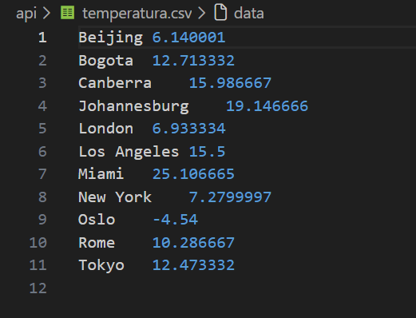
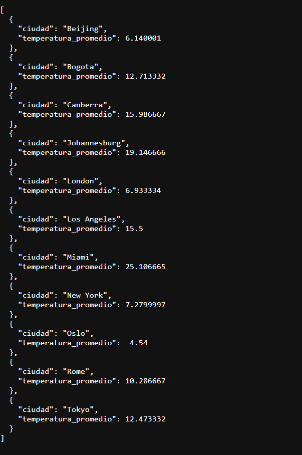
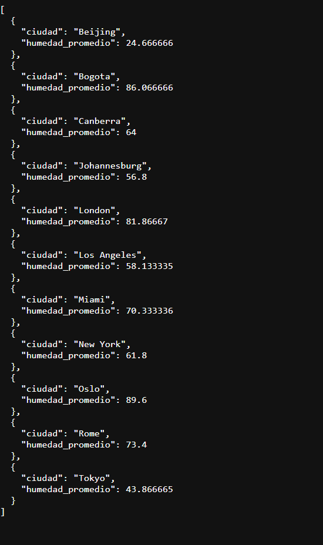
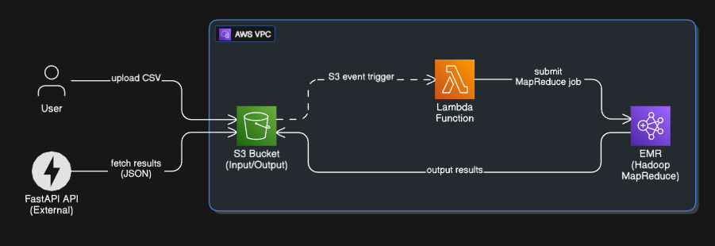

# Proyecto 3 Telematica MAP_Reduce_Hadoop
Integrantes:
- Jose Manuel Carvajal Aristizabal
- Tomas Echavarria Gil
- Manuel Antonio Arenas Lara

## Descripcion del trabajo
En este trabajo se logra El uso de MapReduce para filtrar archivos csv sacados de la api the WEATHERAPI, en donde se filtra por diferentes valores como la temperatura, humedad, condicion del dia, viento, precipitacion.

Se filtra en la api de la siguiente manera:
- Current
- Forecast (14 dias de base)

de ahi se genera un csv, con los resultados obtenidos de la API y luego se filtra en 2 jobs

### Jobs

El primer job que hicimos fue sacar el promedio de temperatura de cada una de las ciudades elegidas,
los archivos para generados para la filtracion de estos se encuentran en la carpeta /mapreduce-app y llevan como nombre WeatherAverageTempDriver/Reducer/Mapper

y se genera un csv llamado temperatura.csv que muestra la siguiente información:

ademas se muestra en linea de la siguiente forma:

El segundo job saca el promedio de la humedad en cada una de las ciudades elegidas, este tambien se encuentra en la carpeta /mappreduce-app y los archivos generados fueron WeatherAverageHumidityDriver/Reducer/Mapper

este genera el csv llamado humedad.csv que muestra la siguiente informacion:

y en linea se muestra la siguiente información:

# Como se ejecuta
## Local
Para poder ejecutar el codigo, se generaron archivos de shell donde se carga la configuracion de los .jar a archivos csv y este los deja en el /output para luego ser procesados 

se debe entrar como primero a la carpeta /mapreduce-app y desde alli ejecutar el ./run_job.sh de este modo todo se carga y se ejecuta, luego con aws se despliega la api utilizada (fastApi)

## AWS

para la ejecucion del proyecto en AWS como primero se necesita tener descargado aws-cli para poder conectarse a las credenciales de aws.
El comando para conectarse es el: aws configure
y alli se llenan los datos de las llaves de acceso, region y formato.

A la par de conectarse a AWS se tiene que generar un bucket donde se coloque la direccion al JAR que en el caso de este proyecto nuestro map reduce se encuentra en [text](mapreduce-app/target/mapreduce-app-1.0.jar)

Ademas se tiene que crear una funcion de lambda en donde se edite el codigo para que cuando reciba una solicitud de PUT este mande un nuevo step al EMR, otra forma de realizarlo es con compilar los archivos de java utilizando mvn clean package y luego con la direccion puesta antes, ejecutar el archivo de shell llamado add_step_emr.sh, que al igual que nuestra funcion lambda este va a subir al EMR todos los archivos y genera las direcciones /input/  /output_humi/ y /output_temp/

Para ver los resultados extraidos del csv llamado weather_dataset, se tiene que entrar a un entorno virtual puesto en el directorio de api/ usando el codigo
- source venv/bin/activate

una vez dentro del entorno virtual ejecutar el comando
- uvicorn app:app --reload --port 8000

una vez se ejecute el uvicorn entrar al link local y utlizar las diferentes rutas que estan escritas en el codigo.
para ver ambos resultados usar: /results/json, donde se mostrara los resultados de las temperaturas y de la humedad. 
para descargar los csv de los resultados hay dos opciones:
- Ir directamente a cada uno de los links para descarga
- Ir al apartado donde se muestra cuales son las direcciones para la descarga

### Opcion 1
para descargar directamente cada uno de los resultados se tiene que utilizar la direccion que quieras.
- Para la temperatura se tiene que poner lo siguiente /download/temp
- para la humedad se tiene que poner /download/humi

### Opcion 2
Si se quiere ir a la direccion para ver cuales son las direcciones para descarga se tiene que poner:
- /results/csv

# Diagrama Pipeline Trabajo

